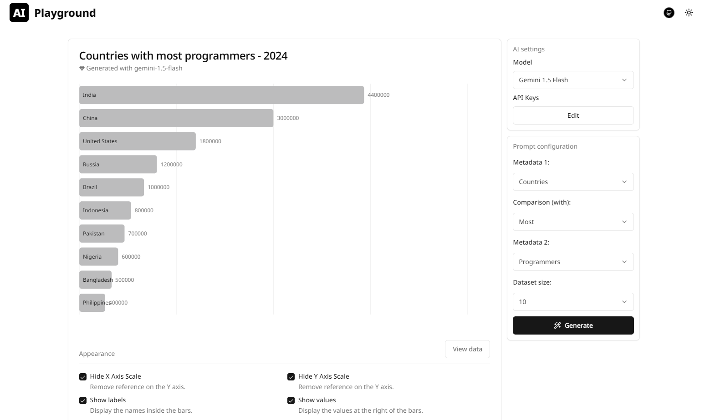

# AI World Data

AI World Data showcases the integration of the [Vercel AI SDK](https://sdk.vercel.ai/), connecting through Google Gemini, Groq, and OpenAI providers.

It combines customizable quantitative metadata about the world and generates graphical representations of the data.

 

[Summer Hackathon 2024 Submission for Vercel competition.](https://github.com/midudev/hackaton-vercel-2024)

- The generated data should not be trusted for real-world purposes.
